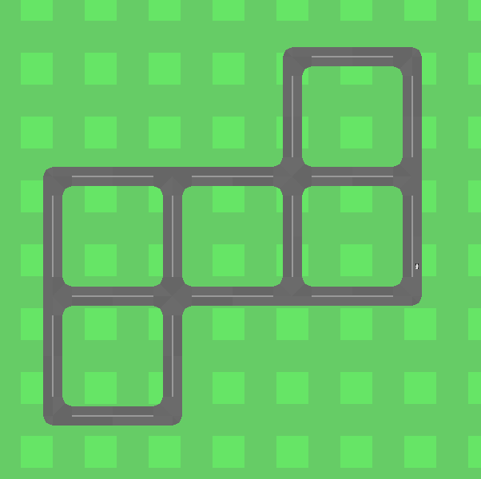
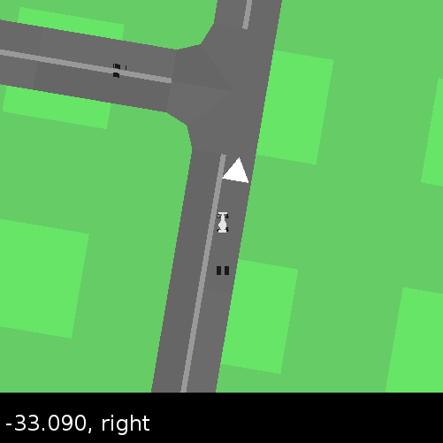

## GridDriving

 &nbsp;&nbsp;&nbsp;&nbsp;&nbsp; 

### Information per timestep

If there are N cars overall, they are assigned indices 0, 1, ... N-1. The `info` looks like:

```json
{
	"0": {
		"traffic_light": True/False,
		"lane_localization": "left/right/off-road/junction",
		"on_rect": True/False,
		"off_road": True/False,
		"junction": True/False,
		"type_intersection": 3/4,
		"only_turn": True/False,
		"speed": ...,
		"pos": ...
	}, ...
}

```

See `example.py` for an example of how to use this environment in RL settings.

### Specifying Lattices Manually

While the environment can be created without arguments, it also accepts an argument with a lattice:

```python
env = GridDriving([
    [1, 1], 
    [1, 1]
])
```

### Graph Construction

This simulator is an extension of the OpenAI Gym [CarRacing-v0](https://gym.openai.com/envs/CarRacing-v0/) environment. The original environment constructs a heavily morphed circlular track and the goal is to loop around on this track. The simulator used in this project extends this environment by constructing a (h, w) grid, where each edge appears with probability p.

Then d edges are deleted from this graph and the road edges are constructed if the graph is connected. Connectedness ensures that if there are multiple vehicles, any vehicle can reach any place and hence the vehicles can collide. This process is repeated for as long as it takes to meet the graph constraints on the number of 1-edge, 2-edge, 3-edge and 4-edge junctions, and connectedness.

### Rendering

Finally, once a connected constraint satisfying graph is created, the road polygons are drawn on a square playfield of size P. For every 3-edge and 4-edge intersections, traffic lights are placed in coordination. The traffic lights follow schedule to cycle between the available signs for every edge and only allow for consistent and safe intersection crossing.

The simulator can be started with n vehicles, and for every step of this environment, each of the vehicles get a viewport capture from their perspective, with only the traffic lights relevant to them showing up in the capture.

### Features
- Traffic schedule and rendering support for 3-edge and 4-edge intersections
- Constraint support for 1-edge, 2-edge, 3-edge, 4-edge intersections
- Finer polygons can be drawn by changing parameters
- Generalized to n vehicles, each vehicle viewer only sees relevant information
- Localization information

### Experiments

The plan is to use this with [Wise-Move](https://git.uwaterloo.ca/wise-lab/wise-move) for hierarchical reinforcement learning experiments. To see an example run, just run the `grid_driving.py` file with no arguments.

### License

AGPLv3, check out licenses folder.
